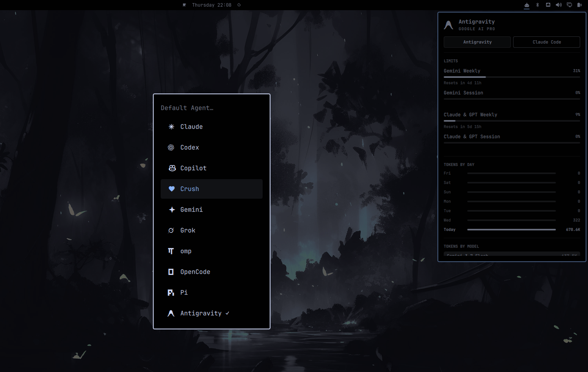
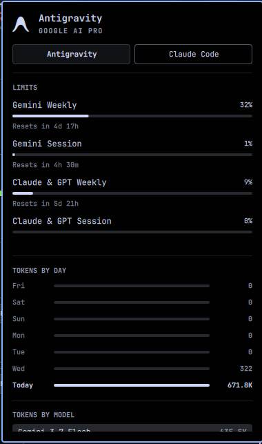
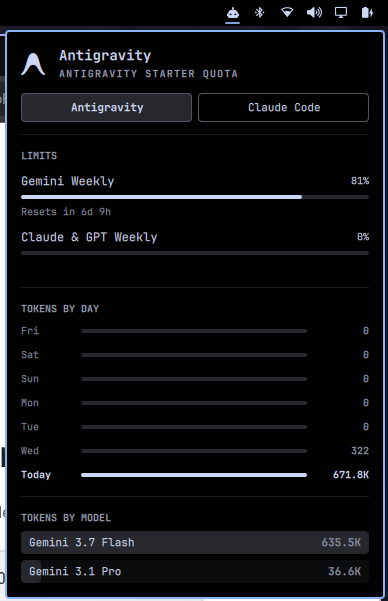
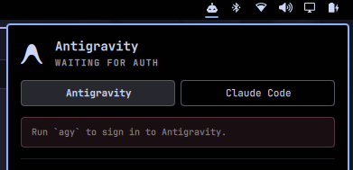
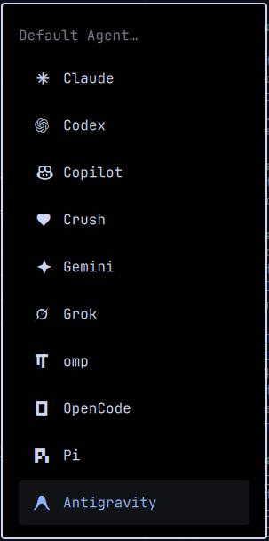
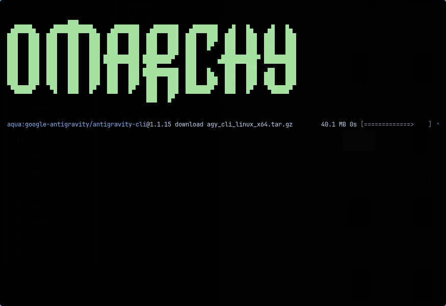

# Antigravity agent integration



Adds the Antigravity CLI (`agy`, Google's Gemini Code Assist terminal agent) as an
Omarchy agent option, alongside the agents shipped by `omarchy.agents`.

## What it does

- **Agents panel tab** — a service writes a usage record to
  `~/.local/state/omarchy/agents/usage/antigravity.json` every 15 minutes (and at
  shell start). The existing agents panel picks it up automatically and shows a
  new "Antigravity" subscription card.

  <p>
    
    
    
  </p>

- **Defaults → Agent menu entry** — a new `Antigravity` row under
  _Defaults → Agent_ in the omarchy menu. Selecting it installs `agy` on demand
  via mise (`aqua:google-antigravity/antigravity-cli`) and launches the TUI.

  <p>
    
    
  </p>

- **Agent launch** — the bar's agent icon / `omarchy agent` flow launches `agy`
  when Antigravity is the default agent (with `--dangerously-skip-permissions`,
  or `agy -p "<prompt>"` for a one-shot prompt).

## How the subscription record is built

The collector (`bin/omarchy-agent-usage-antigravity`) is a dependency-free
Python 3 script. It builds the same record schema as the other agent collectors:

| Field                                                                           | Source                                                                                                                                                                                                                |
| ------------------------------------------------------------------------------- | --------------------------------------------------------------------------------------------------------------------------------------------------------------------------------------------------------------------- |
| `tierLabel`                                                                     | Live call to `cloudcode-pa.googleapis.com/v1internal:loadCodeAssist` with OAuth token. Returns the active tier name, e.g. "Antigravity Starter Quota", "Google AI Pro", etc.                                          |
| `limits`                                                                        | Live call to `cloudcode-pa.googleapis.com/v1internal:retrieveUserQuotaSummary` with companion project ID returning authoritative quota groups, usage fractions, and reset timestamps.                                 |
| `todayTotalTokens` / `todayTokensByModel` / `modelUsage`                        | Scanned from local conversation transcripts (`~/.gemini/antigravity-cli/brain/*/logs/transcript.jsonl`), tracking model switches and token counts per model.                                                          |
| `todayPrompts` / `totalPrompts`                                                 | The CLI's prompt history and transcript records.                                                                                                                                                                      |
| `todaySessions` / `totalSessions` / `activeDays` / `activeDates` / `recentDays` | Brain transcripts combined with `conversation_summaries.db` (`~/.gemini/antigravity-cli/`) for 7-day token and prompt activity charts.                                                                                |
| `usageStatusText` / `authHelpText`                                              | Status banner and help instructions ("Waiting for auth" with `Run \`agy\` to sign in to Antigravity.` when never authed, "Sign-in expired" when credentials expired/invalidated, or rate limit / transport statuses). |

When the stored access token expires, the collector automatically refreshes it
against Google's OAuth2 token endpoint using the stored refresh token. If authentication
is invalidated or missing, the collector reports the corresponding auth state
("Waiting for auth" vs "Sign-in expired"), and gracefully shows last known valid limits
until re-authentication.

**Fallback tier:** if the user is signed out or the live call fails, the tier
label falls back to the declared plan in
`~/.config/omarchy/agents/antigravity.json`:

```json
{ "tierLabel": "Gemini Code Assist" }
```

When it is absent, the neutral label `Antigravity` is used.

## Install

```sh
omarchy plugin add https://github.com/PedroZamecki/omarchy-antigravity --enable
```

Enabling is all that is needed: the service runs `install.sh` itself on load.
The script is idempotent and safe to re-run by hand after `omarchy refresh`:

```sh
~/.config/omarchy/plugins/zamecki.antigravity/install.sh
```

It touches exactly two places outside the plugin folder:

1. Adds or updates the `setup.default.agent.antigravity` row in
   `~/.config/omarchy/extensions/omarchy-menu.jsonc`. The row carries a `when:`
   guard on the plugin folder, so it renders nothing if the plugin is gone.
2. Writes three six-line shims into `~/.local/bin/` — `omarchy-default-agent`,
   `omarchy-agent`, and `omarchy-agent-usage-update` — so the menu rows, bar
   launch, and panel refreshes include Antigravity alongside the built-in agents.
   Each shim only forwards to the matching script in this plugin's `wrappers/`.

Nothing is installed system-wide and no backup files are created. The icon font
(`fonts/omarchy-antigravity.ttf`, a custom glyph built from the Antigravity SVG
mark) is loaded into the shell process by `Service.qml`, and the usage collector
runs from `bin/` in place.

`install.sh` refuses to touch a `~/.local/bin` entry it did not create, and
refuses to write through a symlink, rather than overwriting either.

## Known limitations

- The `omarchy default agent <name>` and `omarchy agent` CLI groups are resolved
  by Omarchy's dispatcher from its own `/usr/share/omarchy/bin` directory only,
  so they keep using the packaged scripts that do not know `antigravity`. The
  interactive paths (menu selection, menu checked-state, bar launch, keybinding)
  go through the shell and use the wrappers, so they work. Running
  `omarchy agent` from a terminal with Antigravity as the default prints a clear
  message and exits.

## Uninstall

Removal is automatic. Omarchy has no uninstall hook, so the plugin covers it from
two sides:

```sh
omarchy plugin remove zamecki.antigravity
```

- **On disable or remove**, `Service.qml` sees the plugin flip to disabled as it
  is destroyed and runs `uninstall.sh` for you. A shell restart does not trigger
  this, because the plugin is still enabled at that point.
- **On any other removal path** — a manual `rm -rf`, or a removal while the shell
  is not running — each shim notices its wrapper is gone the next time it is
  called: it deletes itself, clears a `defaults/agent` set to `antigravity`
  (nothing could launch it any more), and hands the call to the packaged Omarchy
  command. The leftover menu row's `when:` guard already hides it.

To revert everything by hand at any time:

```sh
~/.config/omarchy/plugins/zamecki.antigravity/uninstall.sh
```

This removes the menu row, the three shims (only if they still carry this
plugin's marker), the usage state and cache files, and a `defaults/agent` set
to `antigravity`. It is idempotent.
